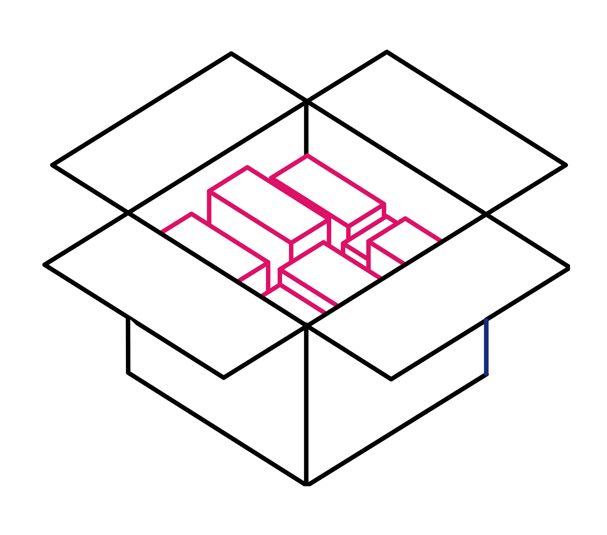

<a name="readme-top"></a>

<!-- PROJECT SHIELDS -->
<!--
*** I'm using markdown "reference style" links for readability.
*** Reference links are enclosed in brackets [ ] instead of parentheses ( ).
*** See the bottom of this document for the declaration of the reference variables
*** for contributors-url, forks-url, etc. This is an optional, concise syntax you may use.
*** https://www.markdownguide.org/basic-syntax/#reference-style-links
-->

[![Contributors][contributors-shield]][contributors-url]
[![Forks][forks-shield]][forks-url]
[![Stargazers][stars-shield]][stars-url]
[![Issues][issues-shield]][issues-url]

<!-- [![LinkedIn][linkedin-shield]][linkedin-url] -->

<!-- PROJECT LOGO -->
<br />
<div align="center">
  <a href="https://github.com/antonztsv/FDDWSS22_HinzerZaitsev">
    
  </a>

<h3 align="center">UNO Kartenspiel</h3>

  <p align="center">
    Projekt im Modul Frameworks, Dienste und Daten im Web
    <br />
    <a href="https://github.com/antonztsv/FDDWSS22_HinzerZaitsev"><strong>Explore the docs »</strong></a>
    <br />
    <br />
    <a href="https://github.com/antonztsv/FDDWSS22_HinzerZaitsev">View Demo</a>
    ·
    <a href="https://github.com/antonztsv/FDDWSS22_HinzerZaitsev/issues">Report Bug</a>
    ·
    <a href="https://github.com/antonztsv/FDDWSS22_HinzerZaitsev/issues">Request Feature</a>
  </p>
</div>

<!-- TABLE OF CONTENTS -->
<details>
  <summary>Table of Contents</summary>
  <ol>
    <li>
      <a href="#about-the-project">About The Project</a>
      <ul>
        <li><a href="#built-with">Built With</a></li>
      </ul>
    </li>
    <li>
      <a href="#getting-started">Getting Started</a>
      <ul>
        <li><a href="#prerequisites">Prerequisites</a></li>
        <li><a href="#installation">Installation</a></li>
      </ul>
    </li>
    <li><a href="#usage">Usage</a></li>
    <li><a href="#roadmap">Roadmap</a></li>
    <li><a href="#contributing">Contributing</a></li>
    <li><a href="#license">License</a></li>
    <li><a href="#contact">Contact</a></li>
    <li><a href="#acknowledgments">Acknowledgments</a></li>
  </ol>
</details>

<!-- ABOUT THE PROJECT -->

## About The Project

[![Product Name Screen Shot][product-screenshot]](https://example.com)

Here's a blank template to get started: To avoid retyping too much info. Do a search and replace with your text editor for the following: `antonztsv`, `FDDWSS22_HinzerZaitsev`, `twitter_handle`, `linkedin_username`, `email_client`, `email`, `project_title`, `project_description`

<p align="right">(<a href="#readme-top">back to top</a>)</p>

### Built With

- 
- 
- 
- 
- 
- 
- 

<p align="right">(<a href="#readme-top">back to top</a>)</p>

<!-- GETTING STARTED -->

## Getting Started

Im folgenden wird erläutert, wie das Projekt lokal gestartet werden kann. Befolgen Sie einfach den Schritten.

<!-- This is an example of how you may give instructions on setting up your project locally.
To get a local copy up and running follow these simple example steps. -->

### Prerequisites

Folgende Programme werden benötigt:

- Docker inkl. docker-compose

  ```
  https://www.docker.com/get-started/
  ```

### Installation

1. Clone the repo
   ```sh
   git clone https://github.com/antonztsv/FDDWSS22_HinzerZaitsev.git
   ```
2. Run config script or copy .env.example files for every backend service to a .env file manually
   ```sh
   ./copy-env.sh
   ```
3. Docker Container mit docker-compose im root Verzeichnis starten
   ```sh
   docker-compose up -d --build
   ```

<p align="right">(<a href="#readme-top">back to top</a>)</p>

<!-- USAGE EXAMPLES -->

## Usage

<!-- Use this space to show useful examples of how a project can be used. Additional screenshots, code examples and demos work well in this space. You may also link to more resources. -->

Das Frontend kann über [`http://localhost:3000`](http://localhost:3000) aufgerufen werden.

### Ablauf:

1. Eingabe Spielername
2. Erstellung eines neuen Spiels
3. Beitritt des Spiels über einen anderen Browser (oder Inkognito)
4. Spiel starten
5. Spiel beenden

<p align="right">(<a href="#readme-top">back to top</a>)</p>

<!-- ROADMAP -->

<!-- ## Roadmap

- [ ] Feature 1
- [ ] Feature 2
- [ ] Feature 3
  - [ ] Nested Feature

See the [open issues](https://github.com/antonztsv/FDDWSS22_HinzerZaitsev/issues) for a full list of proposed features (and known issues).

<p align="right">(<a href="#readme-top">back to top</a>)</p> -->

<!-- CONTRIBUTING -->

<!-- ## Contributing

Contributions are what make the open source community such an amazing place to learn, inspire, and create. Any contributions you make are **greatly appreciated**.

If you have a suggestion that would make this better, please fork the repo and create a pull request. You can also simply open an issue with the tag "enhancement".
Don't forget to give the project a star! Thanks again!

1. Fork the Project
2. Create your Feature Branch (`git checkout -b feature/AmazingFeature`)
3. Commit your Changes (`git commit -m 'Add some AmazingFeature'`)
4. Push to the Branch (`git push origin feature/AmazingFeature`)
5. Open a Pull Request

<p align="right">(<a href="#readme-top">back to top</a>)</p>

<!-- LICENSE -->

<!-- ## License

Distributed under the MIT License. See `LICENSE.txt` for more information.

<p align="right">(<a href="#readme-top">back to top</a>)</p> -->

<!-- CONTACT -->

## Contact

Calvin Hinzer - calvin.hinzer@smail.th-koeln.de
Anton Zaitsev - anton.zaitsev@smail.th-koeln.de

Project Link: [https://github.com/antonztsv/FDDWSS22_HinzerZaitsev](https://github.com/antonztsv/FDDWSS22_HinzerZaitsev)

<p align="right">(<a href="#readme-top">back to top</a>)</p>

<!-- ACKNOWLEDGMENTS -->

<!-- ## Acknowledgments

- []()
- []()
- []() -->

<!-- <p align="right">(<a href="#readme-top">back to top</a>)</p> -->

<!-- MARKDOWN LINKS & IMAGES -->
<!-- https://www.markdownguide.org/basic-syntax/#reference-style-links -->

[contributors-shield]: https://img.shields.io/github/contributors/antonztsv/FDDWSS22_HinzerZaitsev.svg?style=for-the-badge
[contributors-url]: https://github.com/antonztsv/FDDWSS22_HinzerZaitsev/graphs/contributors
[forks-shield]: https://img.shields.io/github/forks/antonztsv/FDDWSS22_HinzerZaitsev.svg?style=for-the-badge
[forks-url]: https://github.com/antonztsv/FDDWSS22_HinzerZaitsev/network/members
[stars-shield]: https://img.shields.io/github/stars/antonztsv/FDDWSS22_HinzerZaitsev.svg?style=for-the-badge
[stars-url]: https://github.com/antonztsv/FDDWSS22_HinzerZaitsev/stargazers
[issues-shield]: https://img.shields.io/github/issues/antonztsv/FDDWSS22_HinzerZaitsev.svg?style=for-the-badge
[issues-url]: https://github.com/antonztsv/FDDWSS22_HinzerZaitsev/issues
[license-shield]: https://img.shields.io/github/license/antonztsv/FDDWSS22_HinzerZaitsev.svg?style=for-the-badge
[license-url]: https://github.com/antonztsv/FDDWSS22_HinzerZaitsev/blob/master/LICENSE.txt
[product-screenshot]: docs/images/screenshot.png

<!-- [react.js]: https://img.shields.io/badge/React-20232A?style=for-the-badge&logo=react&logoColor=61DAFB
[react-url]: https://reactjs.org/ -->

<!-- [node.js]: https://img.shields.io/npm/v/nodejs.svg?logo=nodedotjs
[node-url]: https://nodejs.org/ -->
